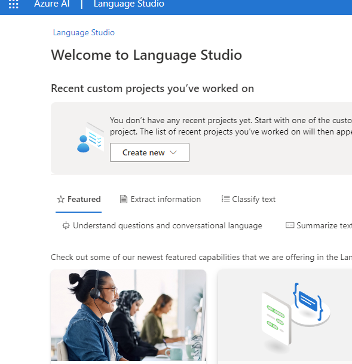

# dio-ai-text-azure
1. Criar Recurso de serviço de linguagem no Portal Azure

2. Acessar o Language Studio

3. Selecionar a análise de sentimentos e opiniões

4. Colocar o input do texto

5. Analisar resultados

